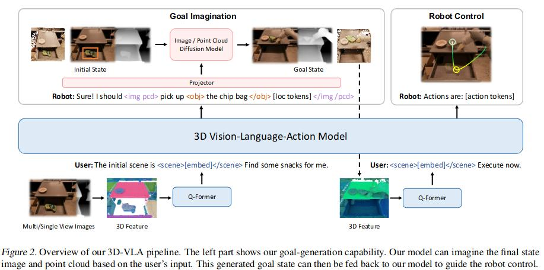
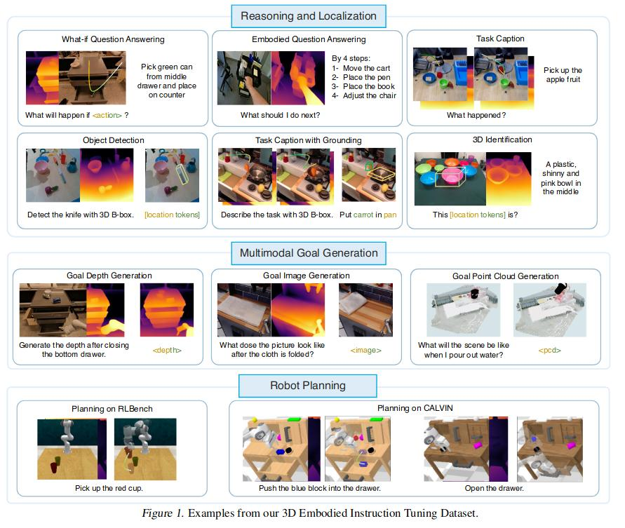
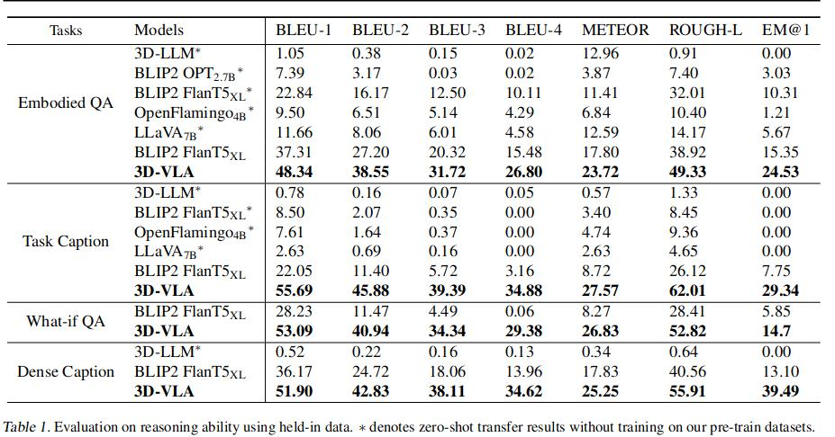
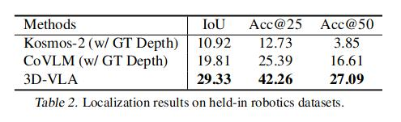
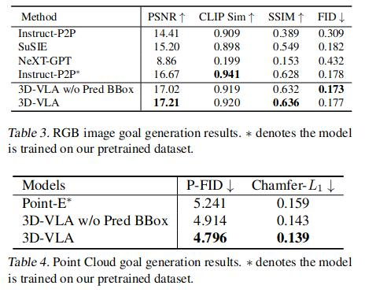
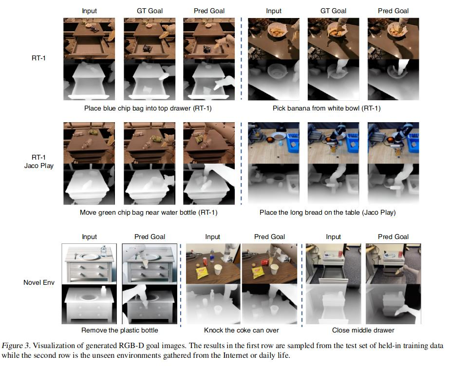
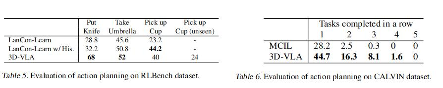

# 3D-VLA: A 3D Vision-Language-Action Generative World Model

[https://vis-www.cs.umass.edu/3dvla](https://vis-www.cs.umass.edu/3dvla)

## Contribution
* a new family of embodied foudnation models that seamlessly link 3D perception, reasoning, and action through a generative world model.

* a large-scale 3D embodied instruction tuning dataset addressing the absence of 3D-related information in existing embodied datasets.

* add interaction tokens to better interact with the environment.
## 3D Embodied Instruction Tuning Dataset

Data source 
* Open-X Embodiment Dataset | Dobb-E | RH20T | RLBench | CALVIN etc.
* Human Object Interaction Datasets(HOI4D) 

To build their own dataset
* Most are 2D & lack of 3D.
* Therefore they use a depth estimator & optical flows.(ZoeDepth)
* After getting the depth maps, directly lift the RGB-D images into 3D point clouds using camera intrinsics and poses.

## Methods
1. buid a backbone, enhance the model's capabilities to interact with 3D world by adding interaction tokens.

2. inject goal generation ability into 3D-VLA by pre-training emobodied diffusion models and employing projector for aligning.

**backbone:**
BLIP2-FlanT5XL, unfreeze both the input and output embeddings for tokens, and the weights of Q-former.

**interaction tokens:**
form: `<obj></obj>` that enclose the object nouns.
e.g. `<obj> a chocolate bar </obj> [loc tokens] on the table`
location tokens: `<loc0-255>`, if 3D, then 6 tokens
robot actions: 7 DoF, `<aloc0-255>, <arot0-255>, <gripper0/1>`, actions are seperated by `<ACT_SEP>`

**pre-training:**
RGBD2RGBD: Stable Diffusion V1.4
p2p: Point-E

**bridging and goal generation:**
challenges: how to seamlessly incorporate the pretrained docoders into the LLMs.
solution: introduce special tokens`<image></image>` and `<pcd></pcd>`, in order to inform the decoder about the type of modal content to output.
projector: mapping decoder features and embeddings from LLM into the space of DM framwork.

## Experiments
4 part: reasoning, localization, goal generation, action planning

### Reasoning:

### Localization:

### Goal Generation:

### Action planning:

