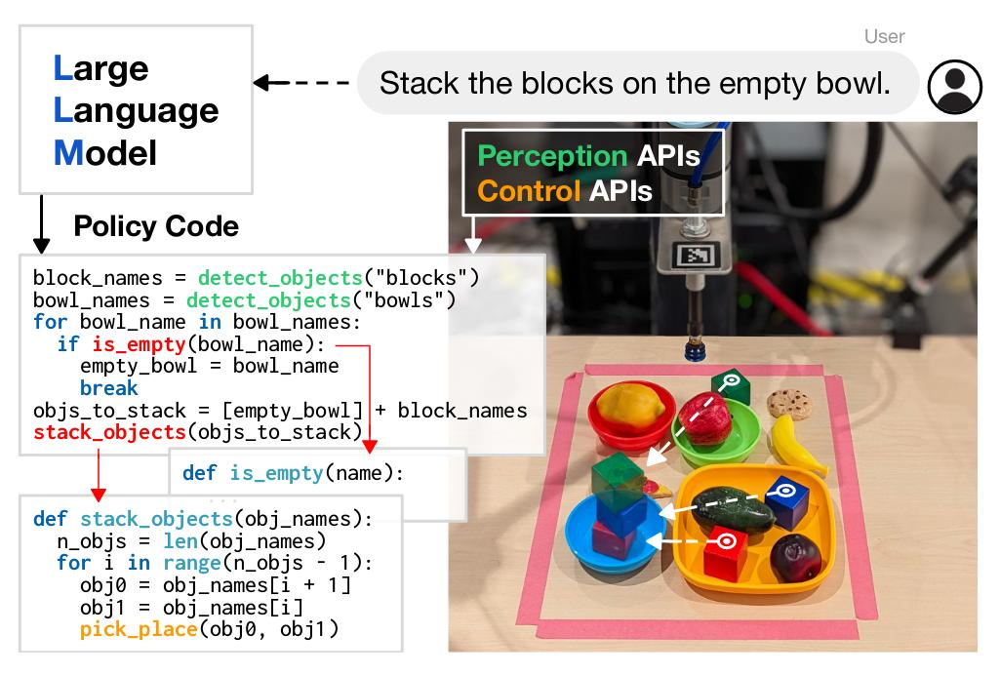

# Code as Policies: Language Model Programs for Embodied Control
[Paper](http://arxiv.org/abs/2209.07753)

## 1. Introduction
Use Language model to generate code to control robot.

- Classic logic structures e.g., sequences, selection (if/else), and loops (for/while) to assemble new behaviors at runtime.
- Third-party libraries to interpolate points (NumPy), analyze and generate shapes (Shapely) for spatial-geometric reasoning, etc.