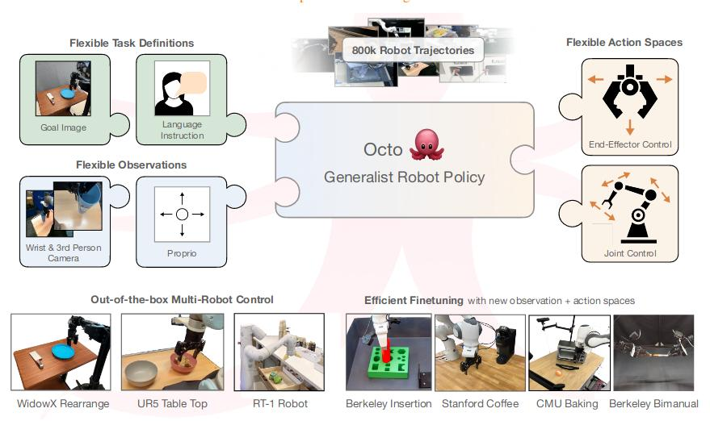
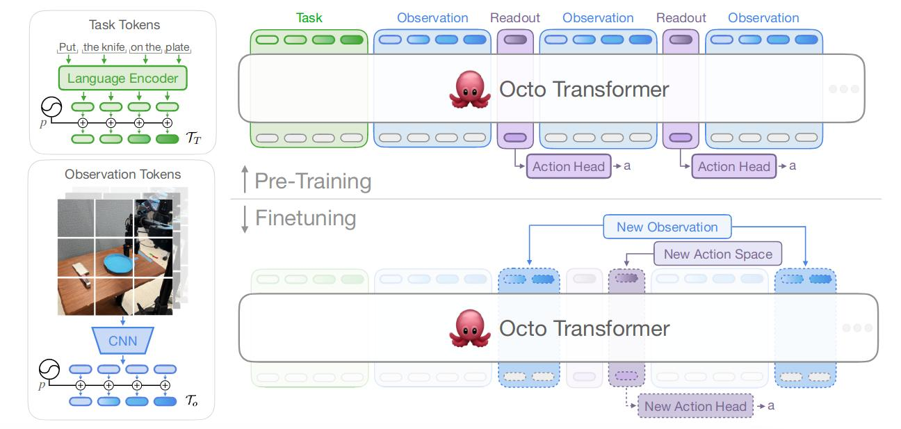

# Octo: An Open-Source Generalist Robot Policy

[[paper]](https://arxiv.org/abs/2405.12213v2) | [[code]](https://octo-models.github.io)

## 1. Introduction

### 1.1 Challenge:
1. Data collection effort when learning from scratch, narrow generalization
2. Training a unified control policy in robot
3. Restrictive to the input observations, not general to the public

### 1.2 Contributions:
* A system for pretraining generalist robot policies more suitable for the diversity of interfaces in downstream robotic applications.
## 2. Method
The whole architecture:

### 2.1 Model
**3 part:** 
- input tokenizer
- transformer backbone
- readout heads

#### Task and observation tokenizers:
- Convert task definitions and observations into a common "tokenized" format using modality-specific tokenizers.
- Language inputs are tokenized and passed through a pretrained transformer that produces embedding tokens.
- Image observation and goals are passed through a shallow conv stack.(t5-based model)

Assemble the input sequence of the transformer by adding learnable position embeddings to task and observation tokens and then arranging them sequentially.

#### Transformer backbone:
After receiving the tokens, use block-wise attention. Every input token only cares about past input, while the task token can be observed by all the token.

#### Readout heads:

Introduce some learnable readout tokens. Each output token cares past input tokens, but the input token does not care about output tokens.

A lightweight "action head" that implements the diffusion process is applied to the embeddings for the readout tokens.

#### Flexibility:
When adding new tasks, observations or loss functions downstream, we can wholly retain the pretrained weights for the transformer, only adding new positional embeddings, a new lightweight encoder or the parameters of the new head.