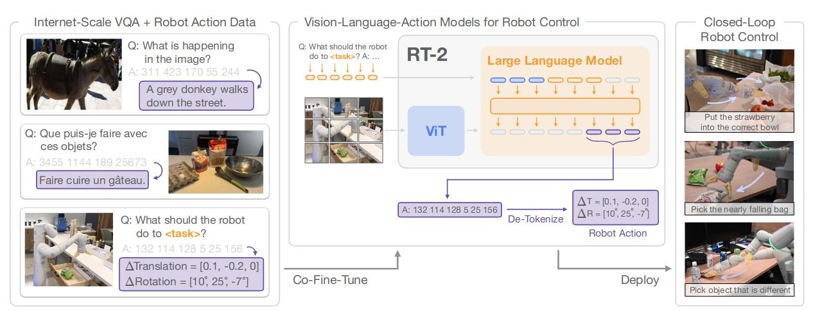

# RT-2: Vision-Language-Action Models Transfer Web Knowledge to Robotic Control
[Paper](https://arxiv.org/pdf/2307.15818.pdf)

## 1. Introduction
Overview

The model receives language and image. The language can be tokenized after embedding, while the image can be tokenized through ViT. The VLM outputs a sequence of numbers(robot actions).

## 2. Visual-Language-Action Models
### 2.1 Pre-Trained Vision-Language Models
Take as input one or more images and produce a sequence of tokens.
### 2.2 Robot-Action Fine-tuning
Directly produces action sequence, no need to break down the user's input.

