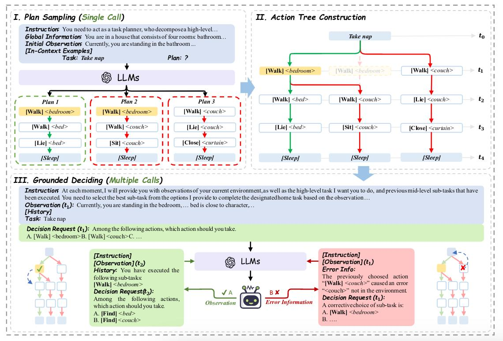

# Tree-Planner: EFFICIENT CLOSE-LOOP TASK PLANNING WITH LARGE LANGUAGE MODELS
[Paper](https://arxiv.org/abs/2310.08582)
## 1. Introduction

The planner devides the queries into 2 parts:
1. single plan-sampling call 
2. multiple grounded-deciding calls

In order to reduce the repetitive computational cost for several components in prompt tokens.

**Stage I:**
Tree-PLANNER prompts the LLM to sample potential task plans with its inherent commonsense(how to define "commonsense"?)

**Stage II:**
Construct an action tree() to aggregate the sampled plans.

**Stage III:**
Tree-PLANNER instructs the LLM again in closed loops to reason on the action tree with environmental observations.

## 2. Preliminary
**Problem setup:** Partially observable Markov decision processes(POMDPs) denoted by $\langle S, O, A, \mathcal{T}\rangle$, $S,O,A$ are sets of states, observations and actions, $\mathcal{T}(s_{t+1}|s_t,a_t)$ is a transition model. $o_t$ represents a subset of the underlying state $s_t$. The optimal policy $\pi (a_t|g,h_t,o_t)$ must take into account not only the current observation $o_t$, but also the entire history of actions $h_t=\left\{a_1, \dots a_{t-1} \right\}$.

## 3. Model

